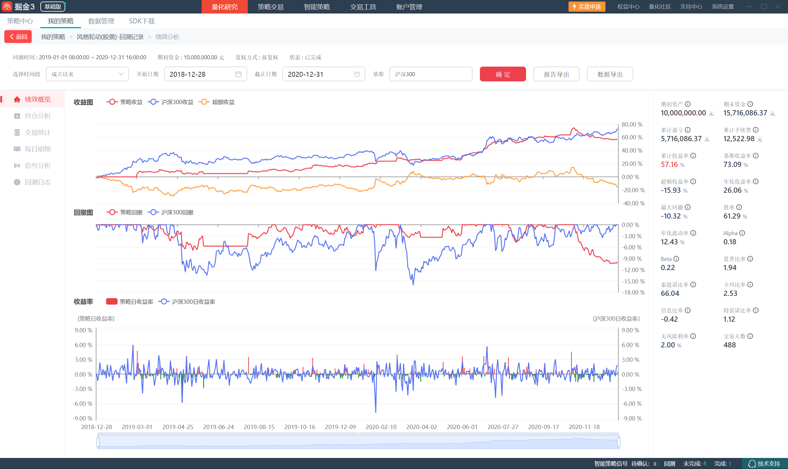

# 量化投资课程作业：风格轮动策略（掘金平台实现）

## 项目简介
本项目为量化投资课程作业，基于掘金量化平台实现了一个风格轮动量化策略，通过每月轮动上证50、沪深300、中证500三个指数的成分股，实现趋势跟踪与风险控制。

## 策略逻辑
1.  **轮动标的**：以上证50、沪深300、中证500为三个市场风格代表
2.  **调仓规则**：每月月初，根据过去20个交易日的收益率，选择表现最好的指数
3.  **选股规则**：买入该指数中市值最大的6只股票
4.  **风控机制**：加入20%止盈、8%止损条件，控制最大回撤

## 回测信息
- 回测时间：2019-01-01 ~ 2020-12-31
- 初始资金：10,000,000 元
- 回测平台：掘金量化3 基础版
- 策略代码：`strategy.py`

## 核心回测指标
- 累计收益率：**57.16%**
- 年化收益率：**26.06%**
- 最大回撤：**-10.32%**
- 夏普比率：**1.94**
- 胜率：**61.29%**

## 结果截图

## 使用方法
1.  在掘金量化平台新建Python策略
2.  将 `strategy.py` 中的代码复制到编辑器
3.  设置回测时间和初始资金，运行回测

## 不足与展望
- 不足：在2019-2020年牛市中跑输沪深300，震荡市表现一般
- 展望：可优化调仓周期、增加过滤条件、引入多因子选股
